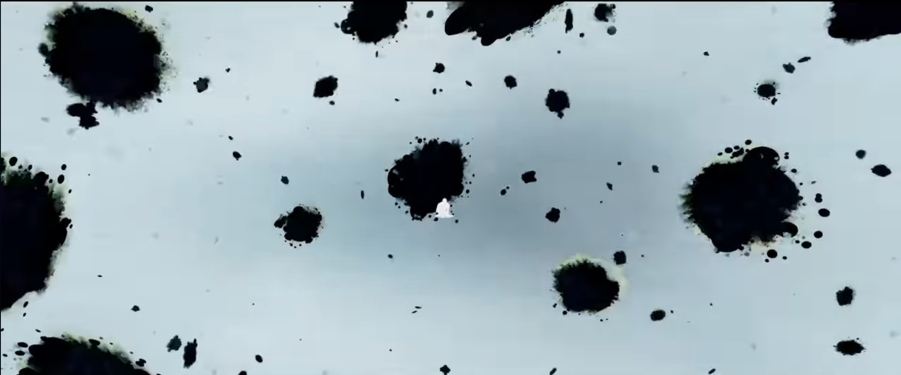
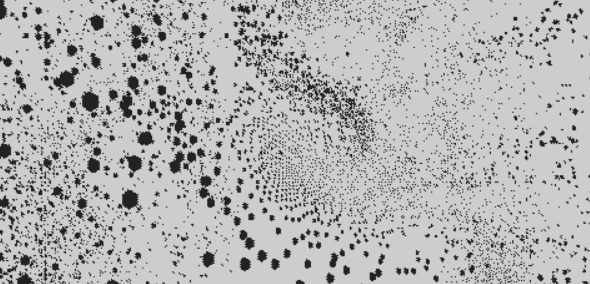

### elam0704_9103_tut6
# Week 8 Quiz


**Part 1** 

###### While watching ‘Spider-Man: Into the Spider-Verse’, I was inspired by the use of rasterized elements in the animation. Several scenes utilize this technique to convey a sense of speed and the transition between different dimensions while maintaining a comic book aesthetic *[1]*. The unique approach adds depth and energy to the storytelling, making the visuals more engaging *[2]*.
##### After some further research, I discovered a coding tutorial on rasterizing images and integrating them into a 3D space [3]. I believe this method could be beneficial for the major assessment because it offers creative pathways to blend 2D drawings or animations within an interactive 3D space. This approach could potentially provide a dynamic and visually rich experience.
*(This paragraph was assisted with ChatGPT for clarity and grammar check)*

**[1]**


**[2]**


**[3]**


*Italic Text* or
_Italic Text_

* Item 1
- Item 2

* Item 1
*Item 2
    * Item 2.1
    * Item 2.2

1. Item 1
1. Item 2
1. Item 2.1
1. item 3

[Link Text](https://www.google.com)


```

function setup() {
    createCanvas
    (400, 400);
}
```

> This is a quote
