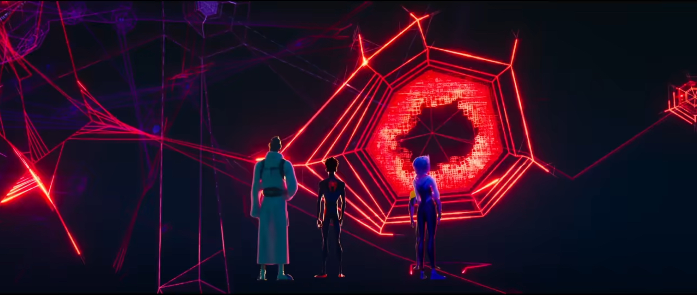

### elam0704_9103_tut6
# Week 8 Quiz

**Part 1** 

###### While watching ‘Spider-Man: Across the Spider-Verse’, I was inspired by the use of rasterized elements in the animation. Several scenes utilize this technique to convey a sense of speed and the transition between different dimensions while maintaining a comic book aesthetic *[1]*. The unique approach adds depth and energy to the storytelling, making the visuals more engaging *[2]*.
##### After some further research, I discovered a coding tutorial on rasterizing images and integrating them into a 3D space *[3]*. I believe this method could be beneficial for the major assessment because it offers creative pathways to blend 2D drawings or animations within an interactive 3D space. This approach could potentially provide a dynamic and visually rich experience.
*(This paragraph was assisted with ChatGPT for clarity and grammar check)*

**[1]**

**[2]**

**[3]**

**Part 2** 

###### The following coding technique utilizes an image into a 3D space.
###### In p5.js, change the rendered mode to WebGL (Web Graphics Library) for a 3D rendering declared in the canvas size. The main functions to achieve the inspirations includes:

###### rotate(): Rotate image to view 3D effects (x/y/z-axis rotations) of rendered rasterized image. *[4]*
**[4]**
.png)

###### translate()+brightness(): To arrange how the dots will be placed for the x/y/z-axis, corresponding to the brightness of the image pixels. *[5]* 

**[5]**
+brightness().png)

###### Ellipse():  To generate the size of the ellipse corresponding to the brightness of the image. *[6]*

**[6]**
.png)

###### Camera() + Perspective(): Using our mouse to interact within the 3D space. *[7]*

**[7]**
+perspective().png)

###### Reference:

[Spider-Man: Across the Spider-Verse link](https://www.youtube.com/watch?v=WEBOTRboXBE&t=940s) screenshots for *[1]* & *[2]*

[Processing tutorial link](https://www.youtube.com/watch?v=WEBOTRboXBE&t=940s) screenshots for *[3]* - *[6]*

[The Coding Train tutorial link](https://www.youtube.com/watch?v=BW3D9WwalQE) screenshot for *[7]*